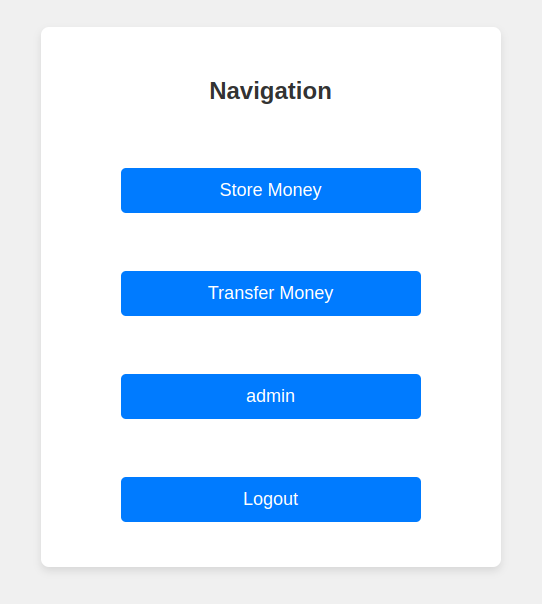
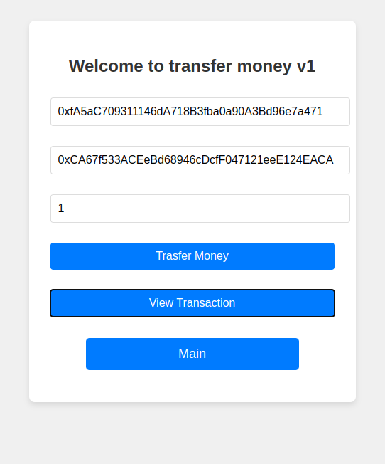
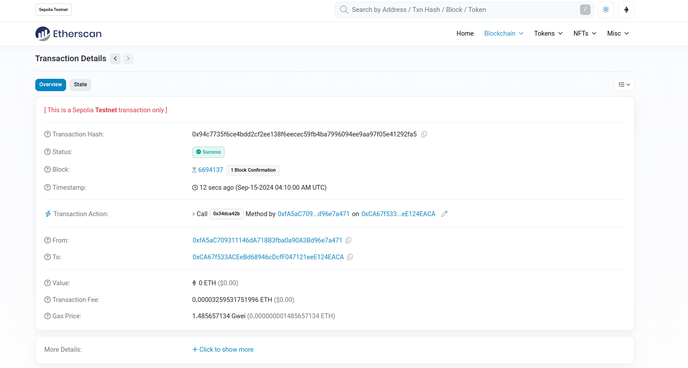

# Decentralized NTU Ticketing System

## 1. Technology and Tools

**Blockchain Platform:**

-  Ethereum

**Dev Tools:**

- Front-end: *HTML, CSS*
- Back-end: *Python with Flask*
- Smart Contract: *Solidity*


## 2. Development

### 2.1 Smart Contract

To handle token transfer and store, the key step is to develop and deploy smart contracts.

The core function of the system is transfer, which is implemented as below:

```
contract PaymentContract {
    address private payer;
    address private payee;
    uint256 private amount;

    constructor() {}

    function weixin(
        uint256 amount_to_transfer,
        address payer_add,
        address payee_add
    ) public {
        payer = payer_add;
        payee = payee_add;
        amount = amount_to_transfer;

        require(payer != address(0), "Invalid payer address");
        require(payee != address(0), "Invalid payee address");
        require(amount > 0, "Amount must be greater than zero");
        payable(payee).transfer(amount);
    }

    function check_transaction()
        public
        view
        returns (address, address, uint256)
    {
        return (payer, payee, amount);
    }
    receive() external payable {}
}

```

### 2.2 Front-end Development
The front-end page structure is:


    index.html -- main.html -- store_money.html

                            -- transfer_money.html

                            -- admin.html -- viewDB.html
    
                                          -- deleteDB.html

We use the smart contract by import the contract Address and ABI, and the Javascript Web3 tool allows the page to connect user's wallet.

### 2.3 Back-end Development

In order to ensure that the system is compatible and accessible on mobile devices, we need to deploy the service on Render, allowing access from different devices. Therefore, a Python script built with Flask is needed as the backend. I use *pymysql* to connect to SQL database and store user info. 

```
@app.route('/main', methods=["get", "post"])
def main():
    user_input = request.form.get("q")
    timestamp = datetime.datetime.now()

    cursor = mydb.cursor()
    cursor.execute("INSERT INTO user VALUES (?, ?)",
                   (user_input, timestamp))
    mydb.commit()

    return render_template('main.html', user_input=user_input)
```

After deploying on Render, users can access the system on their mobile device.

## 3.Outcome
The main navigation page:


This system support simple token transfer:



